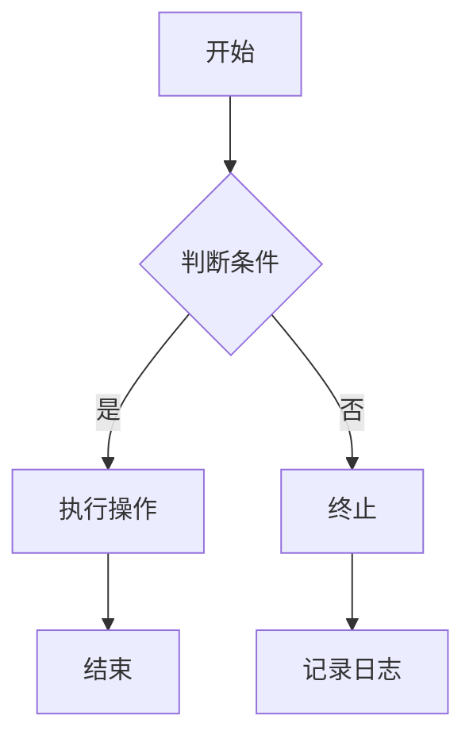
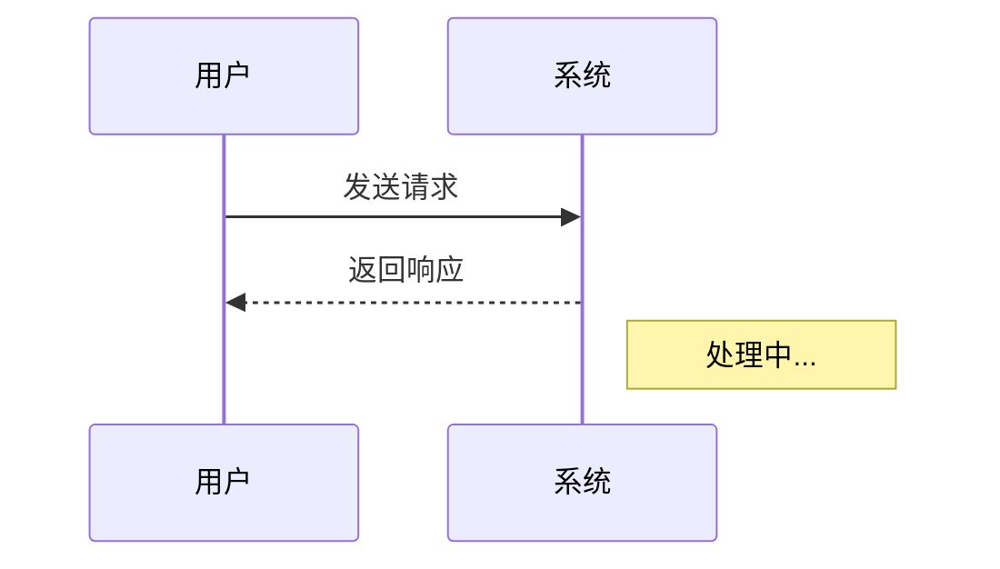
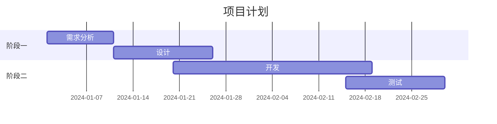
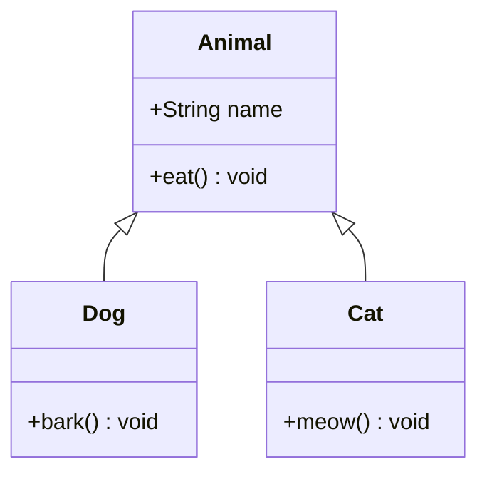
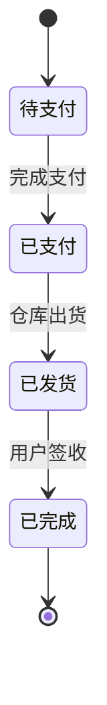
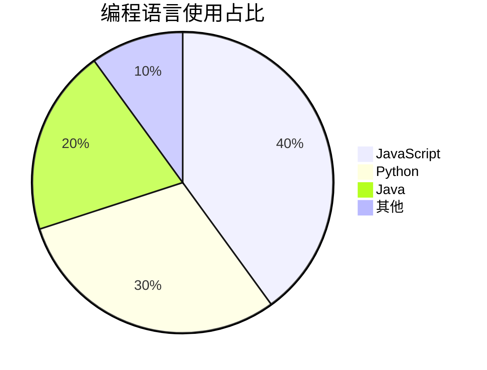

# 一级标题
## 二级标题
### 三级标题
#### 四级标题
##### 五级标题
###### 六级标题

---

## 段落与文本样式

这是一个普通段落。段落之间用空行分隔。  

**粗体** 或 __粗体__  
*斜体* 或 _斜体_  
***粗斜体*** 或 ___粗斜体___  
~~删除线~~  
==高亮标记==（部分引擎支持）  
行内代码：`int main() { return 0; }`  
上标：X^2^（若支持）  
下标：H~2~O（若支持）  
键盘标签：<kbd>Ctrl</kbd> + <kbd>S</kbd>  
下划线：<u>这行文字有下划线</u>  

中文测试：你好，世界！  
Emoji 表情：:smile: :+1: :tada:  

---

## 换行测试

第一行末尾两个空格  
强制换行，这是第二行。

也可以用反斜杠\
实现换行。

---

## 转义字符

\* 星号不是强调 \*  
\` 反引号不是代码 \`  
\- 短横线不是列表  

---

## 链接

### 自动链接
直接写 URL：https://240900.com  
邮箱：<1942239847@qq.com>  

### 行内式链接
[普通链接](https://240900.com)  
[带标题的链接](https://240900.com "鼠标悬停时的提示")  

### 参考式链接
[参考式链接][link-ref]  
另一个指向[相同参考][link-ref]的链接。

[link-ref]: https://240900.com "参考标题"

---

## 图片


参考式图片：  
![参考图片][img-ref]

[img-ref]: https://q.qlogo.cn/g?b=qq&nk=1942239847&s=640

---

## 引用

> 这是第一层引用。
>
> 可以包含多个段落。
>> 嵌套引用第二层。
>>
>> - 引用中的列表
>> - 项目二
>
> ### 引用中的标题
> 
> 引用内也可以有代码：
> `code`

---

## 列表

### 无序列表
* 星号列表项
+ 加号列表项
- 减号列表项

嵌套：
- 一级
  - 二级
    - 三级

### 有序列表
1. 第一项
2. 第二项
   1. 子项一
   2. 子项二
3. 第三项

### 列表中的多段与代码块
1. 列表项第一段。

   列表项第二段（需要缩进对齐）。

2. 列表项包含代码块：
   ```python
   def hello():
       print("Hello from list")
   ```

### 任务列表 (GFM)
- [ ] 待办事项
- [x] 已完成事项
- [ ] 另一个未完成

---

## 代码块

### 围栏代码块（指定语言）
```javascript
function greet(name) {
    console.log(`Hello, ${name}!`);
}
```

### 无语言标识的代码块
```
无语言代码块
第二行
```

### 缩进代码块（四个空格）

    这是缩进代码块
    它由四个空格缩进产生
        def old_style():
            pass

### 行内代码与反引号显示
单个反引号：`` ` ``  
代码中包含反引号：`` `code` ``  

---

## 表格

| 左对齐 | 居中对齐 | 右对齐 |
| :--- | :---: | ---: |
| 单元格 | 数据 | 100 |
| 长内容测试 | 测试 | 999 |

简易表格（部分引擎需要对齐标记）：
| 名称 | 值 |
| --- | --- |
| 简单 | 表 |

表格内可包含样式：**粗体**、`代码`等。

---

## 分割线

三种方式的效果通常相同：

***

---

___

---

## 脚注

这是一个带脚注的句子[^1]。

另一个脚注引用[^2]。

[^1]: 这是第一个脚注的内容。
[^2]: 这是第二个脚注，可以是多行。

---

## 定义列表（部分引擎支持）

术语 1
: 定义 1 的内容

术语 2
: 定义 2 的第一部分
: 定义 2 的第二部分

---

## 数学公式 (LaTeX)

行内公式：$E = mc^2$

块级公式：
$$
\sum_{i=1}^{n} i = \frac{n(n+1)}{2}
$$

---

## HTML 内联与块级元素

<details>
  <summary>点击展开折叠内容</summary>
  这里是折叠区域的内容。可以包含任意 Markdown？取决于引擎。
</details>

<span style="color: red;">红色文字（内联样式）</span>  

<abbr title="HyperText Markup Language">HTML</abbr> 缩写测试。

---

## 注释

<!-- 这段内容不会在渲染后的页面里显示 -->

这是一个段落，中间的<!-- 注释 -->不会影响展示。

---

## Mermaid 图表

### 流程图


### 序列图


### 甘特图


### 类图


### 状态图


### 饼图


---

## 混合嵌套测试

> 1. **有序列表**在引用中
>    - 无序子列表
>      ```bash
>      echo "嵌套代码块"
>      ```
> 2. 继续列表

---

## 特殊情况：URL 与邮箱自动链接

无尖括号：https://240900.com/path?query=string  
带尖括号：<https://240900.com/path?query=string>  
电子邮件：1942239847@qq.com  

---

## 长内容换行与空白

这是一段非常非常长的文字，用来测试博客框架是否能够正确地处理长段落而不出现溢出或奇怪的换行问题，通常这应该自然地由容器宽度控制自动换行。

---

<!-- 测试结束 -->